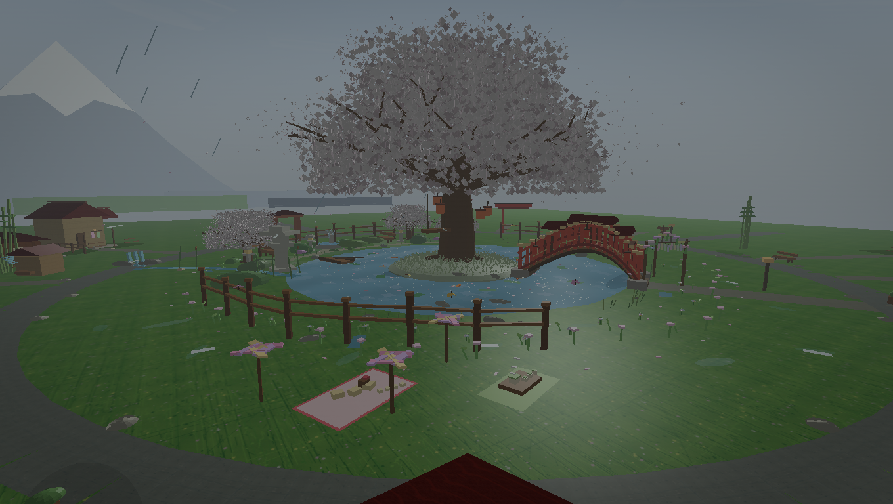
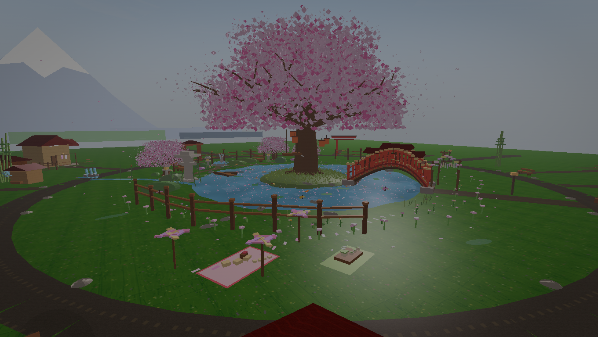
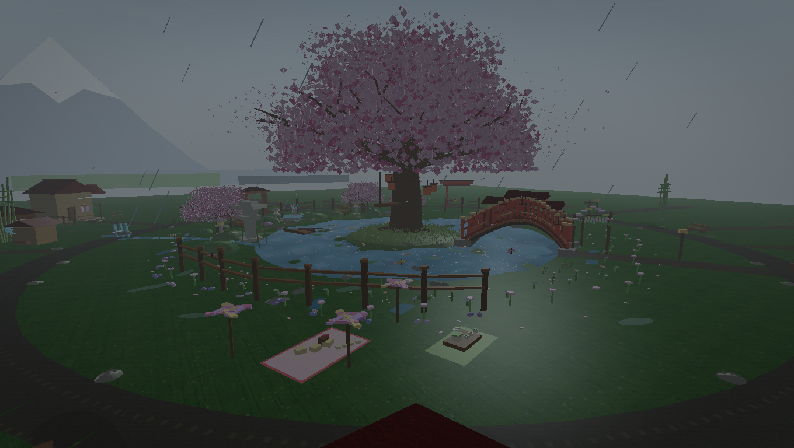
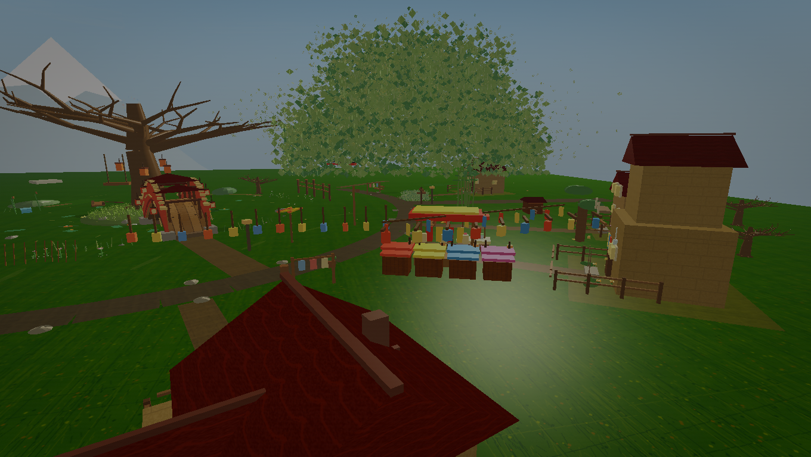
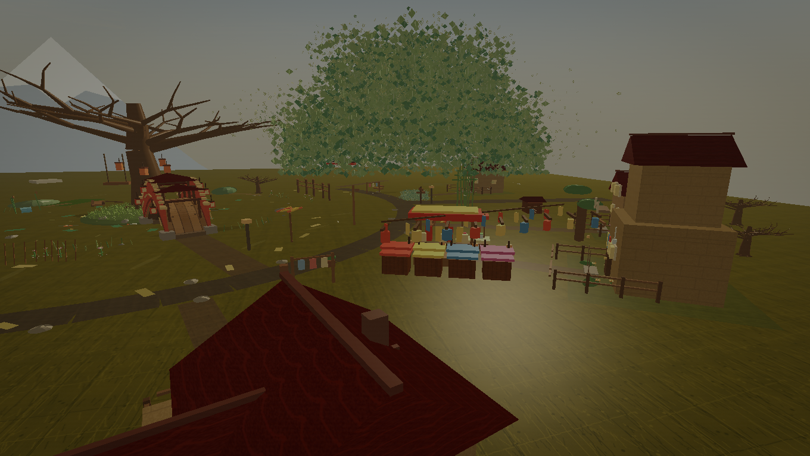
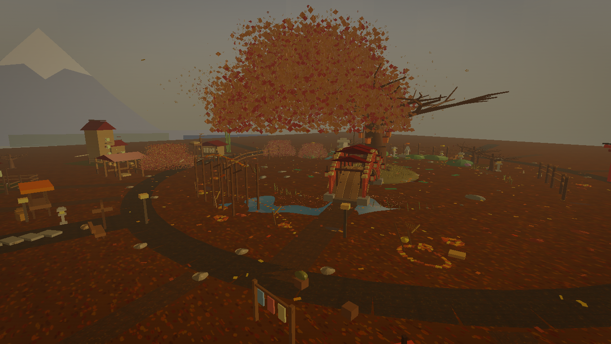
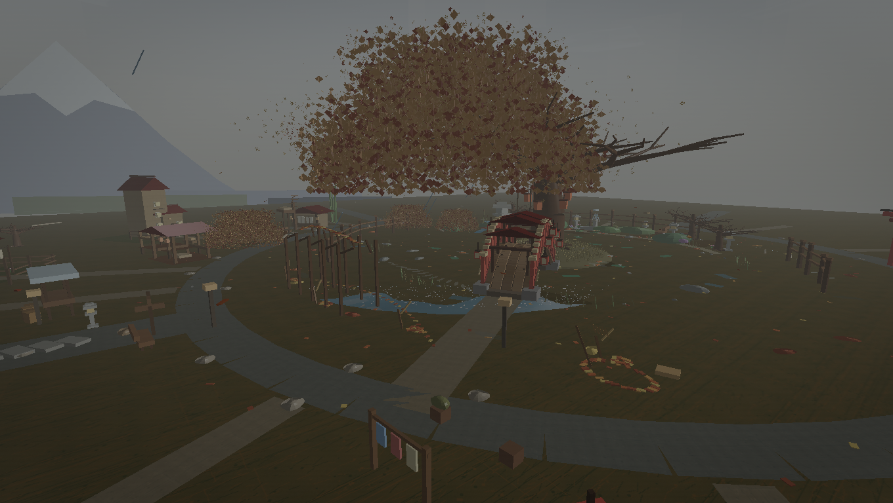
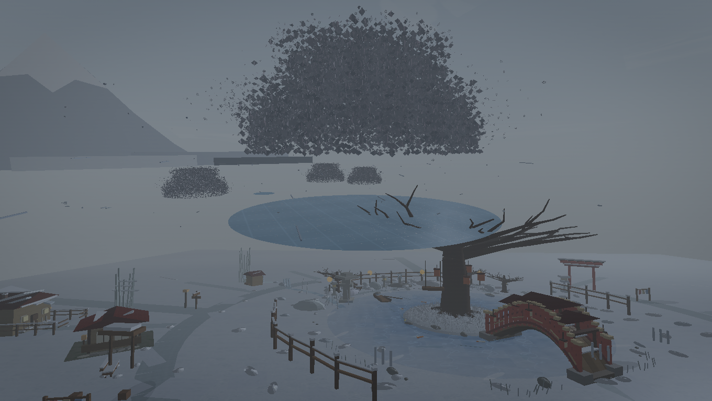

# Season Preview Gallery

Generated from the current OpenGL scene using `python tools\previews\generate_season_previews.py`.

## Early_Spring

## Spring

## Hanami

## Tsuyu

## Summer

## Midsummer

## Late_Summer

## Autumn

## Momiji

## First_Frost

## Winter

## Deep_Winter

