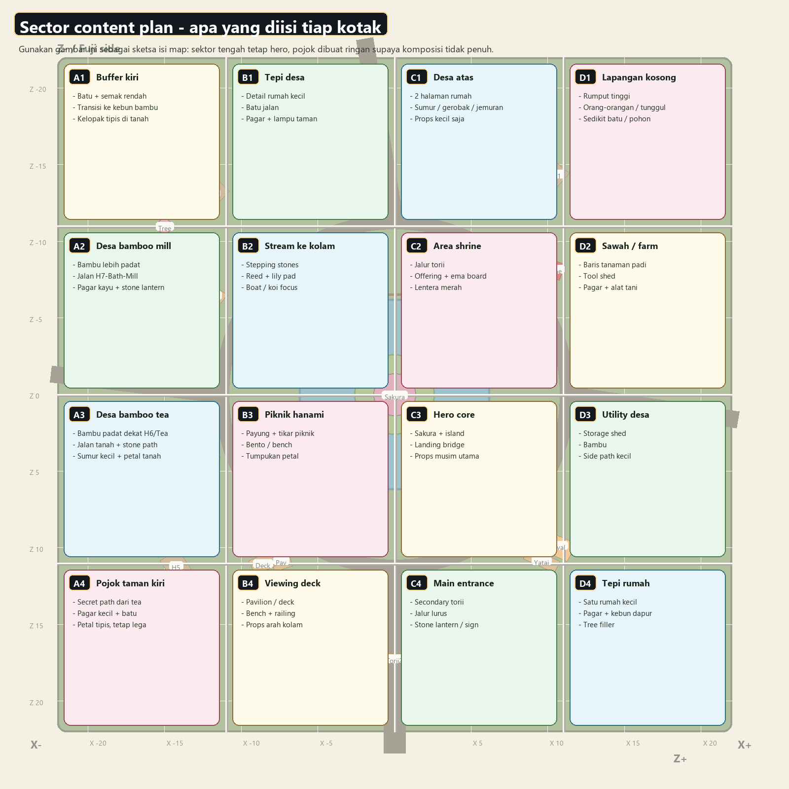

# Sector Content Plan

Ini sketsa isi map per sektor. Pakai bersama denah top-down supaya gampang memilih area yang mau diedit.

| Sector | Theme | Suggested content |
| --- | --- | --- |
| A1 | Buffer kiri | Batu + semak rendah; Transisi ke kebun bambu; Kelopak tipis di tanah |
| B1 | Tepi desa | Detail rumah kecil; Batu jalan; Pagar + lampu taman |
| C1 | Desa atas | 2 halaman rumah; Sumur / gerobak / jemuran; Props kecil saja |
| D1 | Lapangan kosong | Rumput tinggi; Orang-orangan / tunggul; Sedikit batu / pohon |
| A2 | Desa bamboo mill | Bambu lebih padat; Jalan H7-Bath-Mill; Pagar kayu + stone lantern |
| B2 | Stream ke kolam | Stepping stones; Reed + lily pad; Boat / koi focus |
| C2 | Area shrine | Jalur torii; Offering + ema board; Lentera merah |
| D2 | Sawah / farm | Baris tanaman padi; Tool shed; Pagar + alat tani |
| A3 | Desa bamboo tea | Bambu padat dekat H6/Tea; Jalan tanah + stone path; Sumur kecil + petal tanah |
| B3 | Piknik hanami | Payung + tikar piknik; Bento / bench; Tumpukan petal |
| C3 | Hero core | Sakura + island; Landing bridge; Props musim utama |
| D3 | Utility desa | Storage shed; Bambu; Side path kecil |
| A4 | Pojok taman kiri | Secret path dari tea; Pagar kecil + batu; Petal tipis, tetap lega |
| B4 | Viewing deck | Pavilion / deck; Bench + railing; Props arah kolam |
| C4 | Main entrance | Secondary torii; Jalur lurus; Stone lantern / sign |
| D4 | Tepi rumah | Satu rumah kecil; Pagar + kebun dapur; Tree filler |